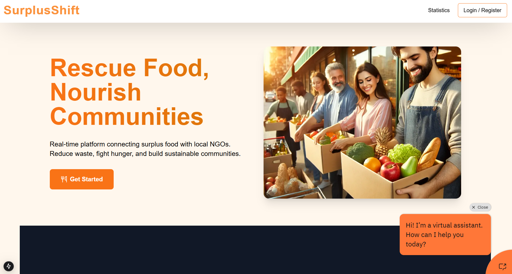
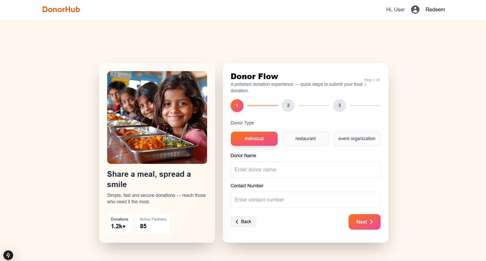
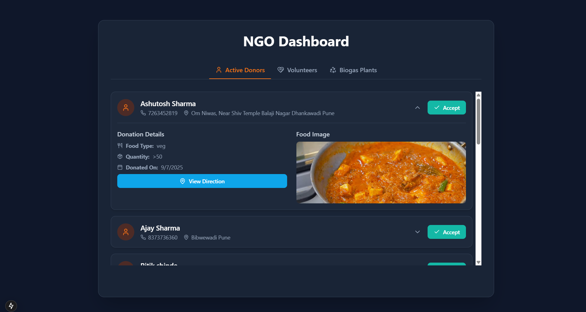

# FOOD PLATFORM
SurplusShift is a real-time platform designed to connect surplus food donors with local NGOs and volunteers. The primary goal is to reduce food waste, fight hunger, and build sustainable communities by streamlining the donation process. SurplusShift leverages modern web alongside deep learning for image classification and IBM Watson Assistant for conversational support.

Through an intuitive interface, donors can upload surplus food details (including images), which are automatically classified to ensure accurate categorization. NGOs and volunteers can then claim, schedule pickups, and track donations in real time — reducing manual overhead and maximizing efficiency.

**Rescue Food, Nourish Communities**  
A real-time platform connecting surplus food donors with local NGOs and volunteers. SurplusShift reduces food waste, fights hunger, and helps build sustainable communities.  

## 🚀 Features  

- 📦 **Food Donation Management** – Donors can upload surplus food details with images.  
- 🤖 **AI-Powered Classification** – Deep learning models automatically categorize food items for accuracy.  
- 🏢 **NGO & Volunteer Matching** – Real-time matching of donations with NGOs and volunteers.  
- 🗓️ **Pickup Scheduling** – NGOs/volunteers can claim donations and schedule pickups.  
- 📊 **Donation Tracking** – Track donations, availability, and delivery in real time.  
- 💬 **Conversational Support** – IBM Watson Assistant provides a chatbot for guidance.  

---

## 🛠️ Tech Stack  

- **Frontend**: Next.js , TailwindCSS  
- **Backend**: Spring Boot / Flask (for ML services)  
- **Database**: MongoDB  
- **AI/ML**:  
  - Deep Learning for Image Classification (PyTorch / TensorFlow)  
  - IBM Watson Assistant for conversational AI  
 

## 📷 Screenshots  

 

## Donor Tab
   

## Ngo Tab
 |

  

