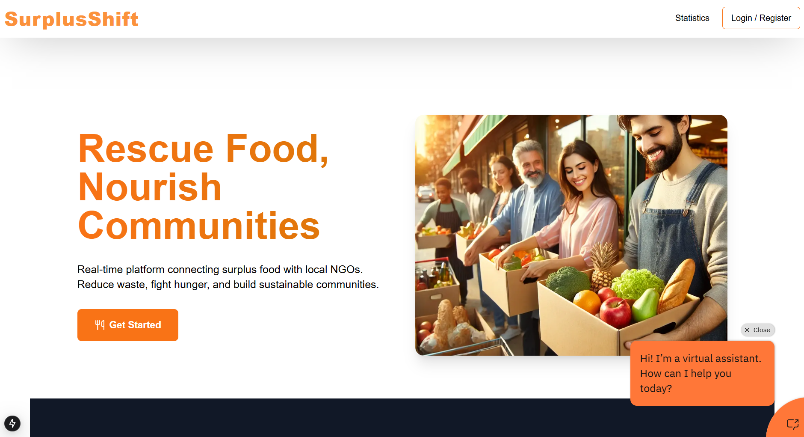

# SurplusShift

[](https://your-live-url.com)  


---

## Table of Contents

1. [Overview](#overview)  
2. [Features](#features)  
3. [Technology Stack](#technology-stack)  
4. [Architecture & Project Structure](#architecture--project-structure)  
5. [Installation & Setup](#installation--setup)  
6. [Environment Variables](#environment-variables)  
7. [Usage](#usage)  
8. [Contributing](#contributing)  
9. [License](#license)  
10. [Contact](#contact)

---
### SurplusShift (Hackathon Project) | Team: Rohit Pal, Saurabh Magar, Onkar Sarambale, Omkar Kathile
## Overview

**SurplusShift** is a real-time platform designed to connect surplus food donors with local NGOs and volunteers. The primary goal is to reduce food waste, fight hunger, and build sustainable communities by streamlining the donation process. SurplusShift leverages modern web technologies (Next.js, Node.js, Express.js, MongoDB) alongside deep learning for image classification and IBM Watson Assistant for conversational support.  

Through an intuitive interface, donors can upload surplus food details (including images), which are automatically classified to ensure accurate categorization. NGOs and volunteers can then claim, schedule pickups, and track donations in real time — reducing manual overhead and maximizing efficiency.

---

## Features

- **Real-Time Donation Management**  
  - Donors post surplus food listings; NGOs/volunteers claim donations instantly.  
  - Push notifications and live updates via WebSockets (Socket.IO).

- **Deep Learning Image Classification**  
  - Integrated a custom-trained model (Python + TensorFlow/PyTorch) that automatically categorizes uploaded images as food vs. non-food and identifies specific food types.  
  - Reduces manual validation time by **60%** and minimizes erroneous listings.

- **IBM Watson x Assistant Integration**  
  - Provides a conversational chatbot for donors, NGOs, and volunteers.  
  - Cuts user query response time by **80%** through automated FAQ and guided workflows.

- **Responsive Frontend (Next.js + Tailwind CSS)**  
  - Donor, NGO, and Volunteer portals built as separate Next.js routes (`/donor`, `/ngo`, `/volunteer`, `/login`, `/redeem`).  
  - Mobile-first design ensures usability across devices.

- **Secure User Authentication & Authorization**  
  - Role-based access control for Donors, NGOs, and Volunteers.  
  - Authentication handled via next-auth (or a similar Next.js-compatible auth library).

- **MongoDB Data Persistence**  
  - Stores user profiles, donation listings, pickup schedules, and audit logs.  
  - Mongoose schemas enforce data integrity.

---

## Technology Stack

- **Frontend**  
  - [Next.js](https://nextjs.org/) (React framework)  
  - [Tailwind CSS](https://tailwindcss.com/) (Utility-first styling)  


- **Backend (Node.js / Express.js)**  
  - [Node.js](https://nodejs.org/) (JavaScript runtime)  
  - [Express.js](https://expressjs.com/) (Web framework)  )  
  - [Mongoose](https://mongoosejs.com/) (MongoDB ODM)

- **Deep Learning**  
  - [Python 3.8+](https://www.python.org/)  
  - TensorFlow / PyTorch (for model training and inference)  
  - Flask (or FastAPI) for exposing the image classification endpoint

- **Conversational AI**  
  - [IBM Watson x Assistant](https://www.ibm.com/cloud/watson-assistant) (Chatbot integration)

- **Database & Storage**  
  - [MongoDB Atlas](https://www.mongodb.com/cloud/atlas) (Cloud database)  
  - Local file storage (for temporary image uploads)  


---

## Architecture & Project Structure

Below is the high-level directory layout for the SurplusShift repository:

```text
/
├── app/                       # Next.js application (Frontend)
│   ├── donor/                 # Donor portal pages/components
│   ├── login/                 # Authentication pages (sign-in / register)
│   ├── ngo/                   # NGO portal pages/components
│   ├── redeem/                # Redeem / Pickup confirmation pages
│   ├── volunteer/             # Volunteer portal pages/components
│   ├── favicon.ico
│   ├── globals.css            # Global Tailwind CSS imports
│   ├── layout.js              # Root layout (header, footer, metadata)
│   └── page.js                # Landing (home) page

├── components/                # Shared React components (UI widgets)
│   ├── Donor/                 # Donor-specific UI components
│   ├── LandingPage/           # Homepage hero, features section
│   ├── Login/                 # Login / Register forms
│   └── NGO/                   # NGO-specific UI components

├── backend/                   # Node.js / Express.js server + Python inference
│   ├── database/              # MongoDB connection & Mongoose models
│   │   ├── models/            # Mongoose schemas (User, Donation, Schedule, etc.)
│   │   └── index.js           # Database initialization
│   │
│   ├── python/                # Deep learning image classification service
│   │   ├── app.py             # Flask/FastAPI entrypoint (predict endpoint)
│   │   ├── foodType.py        # Model architecture & preprocessing
│   │   └── predict.py         # Inference logic (loading weights, returning labels)
│   │
│   ├── routes/                # Express.js route definitions (donations, users, chat)
│   ├── utils/                 # Helper functions (token generation, validation)
│   ├── server.js              # Express.js server setup & Socket.IO integration
│   ├── package.json           # Backend dependencies & scripts
│   └── .env.example           # Example environment variables for backend

├── public/                    # Static assets (icons, open graph images)
│   └── images/                # Logo, placeholder images

├── .gitignore                 # Ignored files & folders
├── package.json               # Root package (monorepo or workspace config)
├── next.config.js             # Next.js configuration
├── tailwind.config.js         # Tailwind CSS configuration
├── postcss.config.js          # PostCSS configuration
└── README.md                  # Project documentation (you are here)
